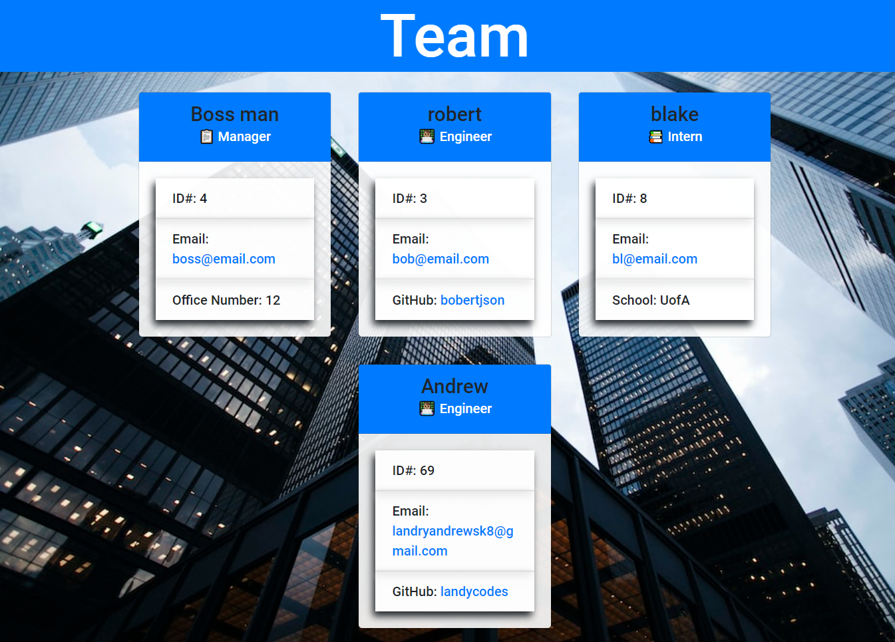

# Team Profile Generator

  

  ## Description 
  This is a command-line application that lets you build a webpage of team members based on prompt input. It will display your team managers info aswell as the info of any Engineers or interns you my have on your team.

  ## Installation instructions
 You can install this app by git-cloning the repository. then install the neccesary dependencies such as npm inquirer an version 8.2.4 and npm jest for testing. then open the command line to the file path of the repository and enter "node index" and you will be prompted to fill in information for each member. once you have selected "done" your webpage will be generated in the ./dist folder. you can open that file in your webpage and your team profile will be presented!
  
  
    [Click here for a video demo!](https://drive.google.com/file/d/1EQanXXD0_u6vN9iG5IqBlUsujV3fMUw4/view)

  
  ## Testing
 You can test the classes used for this application by opening the terminal to the __tests__ file and typing "npm test". All results should pass.
  

  
  
